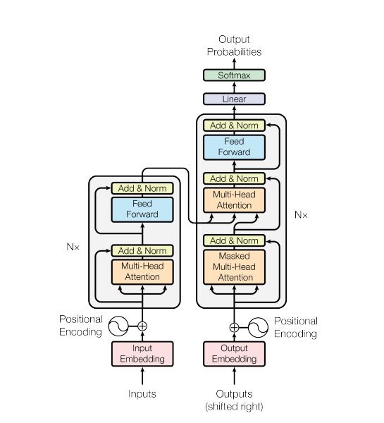

# Eng-Vie Translation Machine
Authors:
- Github: [ktoan911](https://github.com/ktoan911) 
- Email: khanhtoan.forwork@gmail.com 

Advisors:
- Github: [bangoc123](https://github.com/bangoc123) 
- Email: protonxai@gmail.com


Implementation of [Attention Is All You Need](https://arxiv.org/pdf/1706.03762.pdf) . This
library is part of our project: Building an Translation Machine Model library with ProtonX.

<p align="center">
    
</p>

This project is a Vietnamese - English translation machine using a Transformer model. It aims to provide accurate translations, bridging language barriers and meeting the demand for efficient translation tools.

## Architecture Image 




## I.  Set up environment
- Step 1: create a Conda environment named your_env_name with Python version  3.10.14

```python
conda create -n ${your_env_name} python= 3.10.14
```

- Step 2: Activate the newly created environment using the following command
```
conda activate ${your_env_name}
```

- Step 3: Install Packages from requirements.txt

```
pip install -r requirements.txt
``` 

## II.  Set up your dataset

This project utilized [mt_eng_vietnamese Dataset](https://huggingface.co/datasets/mt_eng_vietnamese/viewer/iwslt2015-en-vi/train?p=1)
```
from datasets import load_dataset

dataset = load_dataset('mt_eng_vietnamese', 'iwslt2015-en-vi')
```
- We convert the loaded dataset to a pandas DataFrame for easier manipulation and save the DataFrame to a CSV file in folder `Data` and tokenizer saved in folder `Tokenizer`
- We apply BPE (Byte Pair Encoding) tokenization to the dataset to handle rare words effectively. The processed dataset is then saved in the Arrow format for faster data loading


## III. Training Process

There are some important arguments for the script you should consider when running it:

### Model config : 
To configure the model, you can adjust the following parameters:

- `max-length-input`: Maximum length of input sequences. Default is 64.
- `max-length-target`: Maximum length of target sequences. Default is 64.
- `num-heads-attention`: Number of attention heads in the multi-head attention layers. Default is 8. It is in [3.2.2](https://arxiv.org/pdf/1706.03762.pdf) of the paper
- `vocab-size`: Number of tokens. Default is 20000.
- `dff`: Dimensionality of the feedforward network. Default is 512. It is in [3.3](https://arxiv.org/pdf/1706.03762.pdf) of the paper
- `num-layers`: Number of layers in the Transformer model. Default is 6.
- `d-model`: Dimensionality of the model. Default is 512. It is in [3.2.2](https://arxiv.org/pdf/1706.03762.pdf) of the paper
- `batch-size`: Batch size for training. Default is 64.
- `epochs`: Number of epochs for training. Default is 10.
- `dropout-rate`: Dropout rate for regularization. Default is 0.1.
- `path-token-en`: Path to English tokenizer.
- `path-token-vi`: Path to Vietnam tokenizer.

Make sure to specify the following paths: 
- `path-train`: Path to the training dataset. This argument is required.
- `path-valid`: Path to the validation dataset. This argument is required.
- `path-test`: Path to the testing dataset. This argument is required.
- `checkpoint-path`: Path to save model checkpoints. Default is 'model.weights.h5'.

Training script:


```bash

python train.py --max-length-input ${max-length-input} --max-length-target ${max-length-target} --num-heads-attention ${num-heads-attention} --vocab-size ${vocab-size} --dff ${dff} --num-encoder-layers ${num-encoder-layers} --d-model ${d-model} --batch-size ${batch-size} --epochs ${epochs} --dropout-rate ${dropout-rate} --path-train ${path-train} --path-valid ${path-valid} --path-test ${path-test} --path-token-en ${path-token-en} --path-token-vi ${path-token-vi} --checkpoint-path ${checkpoint-path}

```

Example: 
```bash
#!/bin/bash

# Directly input numerical values
python train.py \
    --max-length-input 100 \
    --max-length-target 100 \
    --num-heads-attention 8 \
    --vocab-size 10000 \
    --dff 512 \
    --num-encoder-layers 4 \
    --d-model 128 \
    --batch-size 64 \
    --epochs 10 \
    --dropout-rate 0.2 \
    --path-train "/path/to/training/data" \
    --path-valid "/path/to/validation/data" \
    --path-test "/path/to/testing/data" \
    --path-token-en "/path/to/tokenized/english/data" \
    --path-token-vi "/path/to/tokenized/vietnamese/data" \
    --checkpoint-path "/path/to/save/checkpoints"

```


## IV. Predict Process

```bash
python predict.py --max-length-input ${max-length-input} --max-length-target ${max-length-target} --num-heads-attention ${num-heads-attention} --vocab-size ${vocab-size} --dff ${dff} --num-encoder-layers ${num-encoder-layers} --d-model ${d-model} --batch-size ${batch-size} --epochs ${epochs} --dropout-rate ${dropout-rate} --model-path ${model_checkpoint} --path-token-vi ${path_to_vietnamese_tokenizer} --path-token-en ${path_to_english_tokenizer} --predict-path ${path_to_prediction_data}
```

### Arguments :
  - `model-path`: Path to the saved model.
  - `path-token_vie`: Path to the tokenizer for Vietnamese. Required.
  - `path-token_en`: Path to the tokenizer for English. Required.
  - `predict-path`: Path to the data for prediction. Required.

## V. Result and Comparision

Transformer Translation model
```
Epoch 28/30
2084/2084 [==============================] - 6786s 2s/step - loss: 1.8131 - cal_acc: 0.7339 - val_loss: 1.9632 - val_cal_acc: 0.7873
Epoch 29/30
2084/2084 [==============================] - 6789s 2s/step - loss: 1.7991 - cal_acc: 0.7388 - val_loss: 1.9482 - val_cal_acc: 0.7889
Epoch 30/30
2084/2084 [==============================] - 6788s 2s/step - loss: 1.7628 - cal_acc: 0.7440 - val_loss: 1.9595 - val_cal_acc: 0.7880
```

In test data, we compute bleu score to evaluate this model and the result is :
```
Number of test to compute BLEU score: 256
Bleu score is 26.246422342661019
```

The model's performance improves significantly over three epochs, with loss decreasing and accuracy increasing. 


